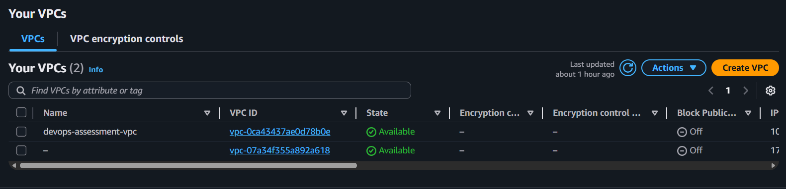
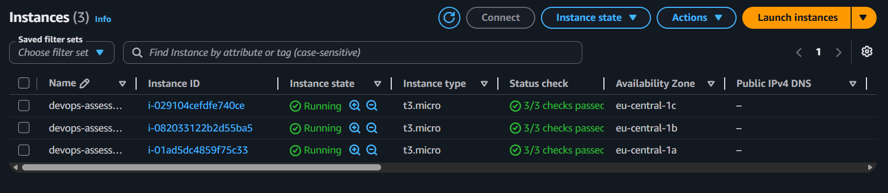
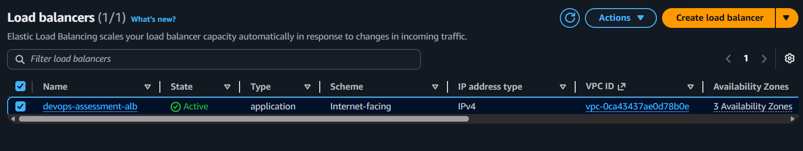
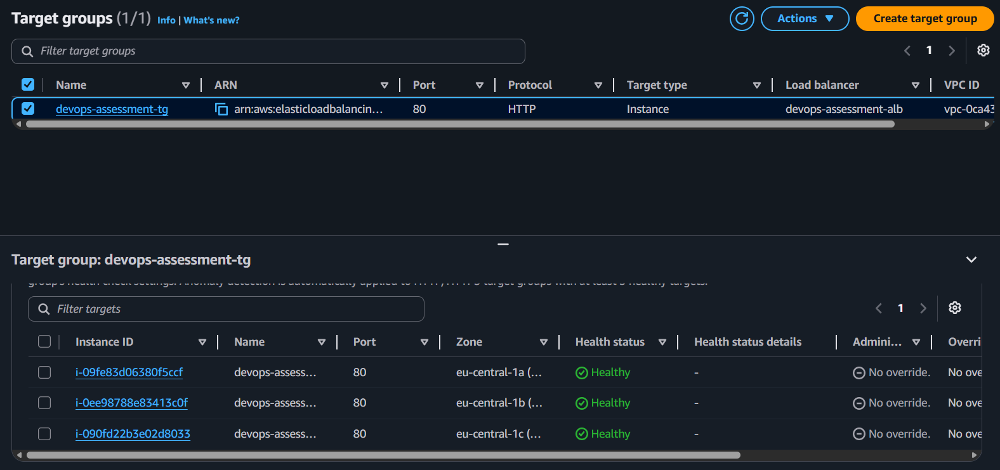

# AWS 3-Tier Infrastructure with Terraform

Production-ready 3-tier AWS infrastructure provisioned with Terraform and configured with Ansible.

## Architecture

- **VPC** with 9 subnets across 3 Availability Zones
  - 3 Frontend subnets (public) → Internet Gateway
  - 3 Backend subnets (private) → NAT Gateway
  - 3 Database subnets (isolated) → Blackhole
- **3 EC2 instances** (Ubuntu 22.04 LTS, t3.micro) in separate AZs
- **Application Load Balancer** (internet-facing, port 80)
- **S3 bucket** for static content storage
- **IAM Role** for EC2 → S3 access

## Tech Stack

- Terraform ~> 5.0
- AWS (VPC, EC2, ALB, S3, IAM, NAT Gateway)
- Ansible (nginx installation and configuration)
- Ubuntu 22.04 LTS

## Quick Start

```bash
# Clone the repo
git clone https://github.com/kenze-p/terraform-aws-3tier.git
cd terraform-aws-3tier

# Configure AWS credentials
aws configure

# Deploy infrastructure
terraform init
terraform plan
terraform apply

# Destroy when done
terraform destroy
```

## Configuration

All variables can be adjusted in `terraform.tfvars`:

| Variable | Default | Description |
|---|---|---|
| `aws_region` | eu-central-1 | AWS region |
| `instance_type` | t3.micro | EC2 instance type |
| `vpc_cidr` | 10.0.0.0/16 | VPC CIDR block |

## Ansible

Installs and configures nginx on EC2 instances:

```bash
export S3_BUCKET=$(terraform output -raw s3_bucket_name)
ansible-playbook -i ansible/inventory.ini ansible/playbook.yml
```

## Screenshots

### VPC


### EC2 Instances


### ALB


### Target Group - Healthy
